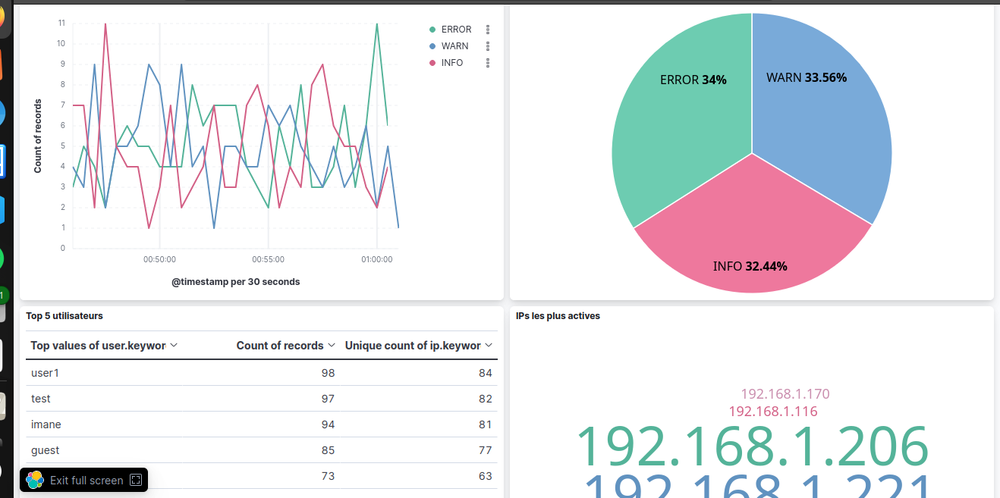

# 🛡️ Mini-SIEM - Système de Surveillance de Sécurité



## 📖 Description
Mini-SIEM maison avec **ELK Stack** (Elasticsearch, Logstash, Kibana).  
Il génère des logs de sécurité simulés, les analyse, les stocke et les visualise en temps réel.  
Idéal pour comprendre les bases de la cybersécurité, du monitoring et de l’analyse de données.

## 🏗️ Architecture
```
Générateur Node.js → Logstash → Elasticsearch → Kibana Dashboard
```

## ✨ Fonctionnalités
- ✅ Génération de logs réalistes (connexions, échecs, actions)
- ✅ Parsing automatique avec Logstash (grok patterns)
- ✅ Stockage centralisé et recherche ultra-rapide
- ✅ Dashboard temps réel (Kibana)
- ✅ Détection d’anomalies : force brute, pics d’activité, IPs suspectes

## 🛠️ Technologies utilisées
| Outil            | Rôle |
|------------------|------|
| **Elasticsearch**| Moteur de recherche / stockage |
| **Logstash**     | Pipeline d’ingestion et transformation |
| **Kibana**       | Interface de visualisation |
| **Docker**       | Conteneurisation de toute la stack |
| **Node.js**      | Générateur de logs simulés |

## 📦 Prérequis
- Docker & Docker Compose
- Node.js (v14+)
- 4 Go de RAM disponibles

## 🚀 Installation et lancement

1. **Cloner le dépôt**
   ```bash
   git clone https://github.com/VOTRE-UTILISATEUR/cybersecurity_projects.git
   cd cybersecurity_projects/mini-siem
   ```

2. **Démarrer l’infrastructure (ELK)**
   ```bash
   docker-compose up -d
   ```

3. **Générer les logs**
   ```bash
   node generator.js
   ```

4. **Accéder à Kibana**  
   Ouvrez votre navigateur sur [http://localhost:5601](http://localhost:5601)  
   - Créez l’index pattern : `siem-logs-*` (champ temporel `@timestamp`)
   - Allez dans **Discover** pour voir les logs bruts
   - Ouvrez le dashboard préconfiguré (si importé) ou créez vos propres visualisations

## 📸 Captures d’écran

| Composant | Aperçu |
|-----------|--------|
| **Dashboard complet** |  |
| **Activité par niveau (line chart)** |  |
| **Top 5 utilisateurs** |  |
| **Logs bruts (Discover)** |  |
| **Génération des logs (terminal)** |  |

## 🔍 Exemple de détection d’anomalies
Le système peut détecter :
- **Brute force** : plus de 5 échecs de connexion depuis la même IP en moins d’une minute.
- **Activité anormale** : connexions à des heures inhabituelles (ex. 3h du matin).
- **IPs actives** : visualisation des adresses IP les plus sollicitées.

## 🧠 Compétences mises en œuvre
- Cybersécurité (SIEM, détection d’intrusion)
- Data engineering (pipeline ETL, parsing de logs)
- DevOps (Docker, orchestration)
- Data visualization (Kibana Lens)

## 📈 Améliorations possibles
- Ajout de sources réelles (logs Apache, Syslog, Windows Event Log)
- Alertes par email / webhook (Slack, Discord)
- Machine learning pour la détection avancée
- Dashboard mobile responsive

## 🤝 Contribuer
Les suggestions et PRs sont les bienvenues !  
Contactez-moi sur [LinkedIn](https://linkedin.com/in/votre-profil) ou ouvrez une issue sur GitHub.

## 📄 Licence
MIT

---

